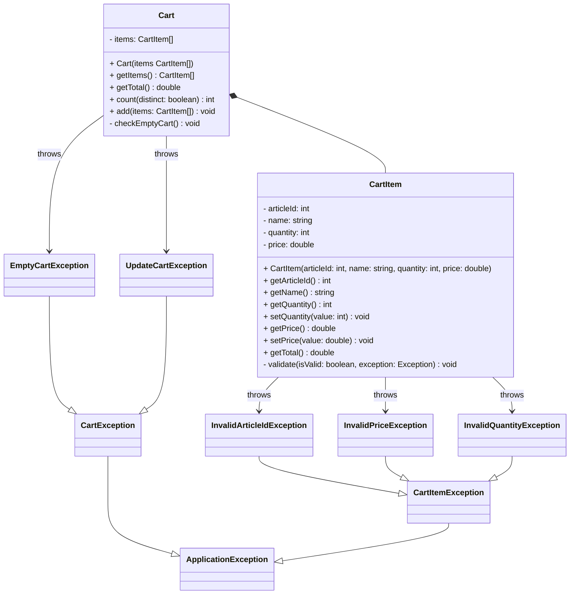

```mermaid
classDiagram
    class CartItem {
        - articleId: int
        - name: string
        - quantity: int
        - price: double
        + CartItem(articleId: int, name: string, quantity: int, price: double)
        + getArticleId() int
        + getName() string
        + getQuantity() int
        + setQuantity(value: int) void
        + getPrice() double
        + setPrice(value: double) void
        + getTotal() double
        - validate(isValid: boolean, exception: Exception) void
    }

    class Cart {
        - items: CartItem[]
        + Cart(items CartItem[])
        + getItems() CartItem[] 
        + getTotal() double
        + count(distinct: boolean) int
        + add(items: CartItem[]) void
        - checkEmptyCart() void
    }

    Cart *-- CartItem

    class EmptyCartException {
    }

    class UpdateCartException {
    }

    class CartException {
    }

    class InvalidArticleIdException {
    }

    class InvalidPriceException {
    }

    class InvalidQuantityException {
    }
    
    class CartItemException {
    }

    class ApplicationException {
    }

    InvalidArticleIdException --|> CartItemException
    InvalidPriceException --|> CartItemException
    InvalidQuantityException --|> CartItemException

    EmptyCartException --|> CartException
    UpdateCartException --|> CartException

    CartException --|> ApplicationException
    CartItemException --|> ApplicationException

    CartItem --> InvalidArticleIdException : throws
    CartItem --> InvalidPriceException : throws
    CartItem --> InvalidQuantityException : throws

    Cart --> EmptyCartException : throws
    Cart --> UpdateCartException : throws
```