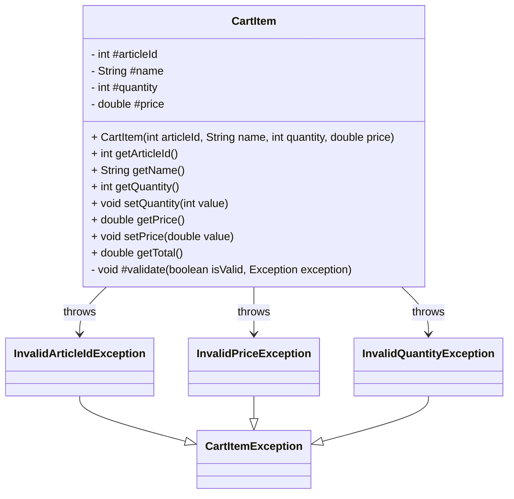

```mermaid
classDiagram
    class CartItem {
        - int #articleId
        - String #name
        - int #quantity
        - double #price
        + CartItem(int articleId, String name, int quantity, double price)
        + int getArticleId()
        + String getName()
        + int getQuantity()
        + void setQuantity(int value)
        + double getPrice()
        + void setPrice(double value)
        + double getTotal()
        - void #validate(boolean isValid, Exception exception)
    }

    class InvalidArticleIdException {
    }

    class InvalidPriceException {
    }

    class InvalidQuantityException {
    }
    
    class CartItemException {
    }

    InvalidArticleIdException --|> CartItemException
    InvalidPriceException --|> CartItemException
    InvalidQuantityException --|> CartItemException

    CartItem --> InvalidArticleIdException : throws
    CartItem --> InvalidPriceException : throws
    CartItem --> InvalidQuantityException : throws
```